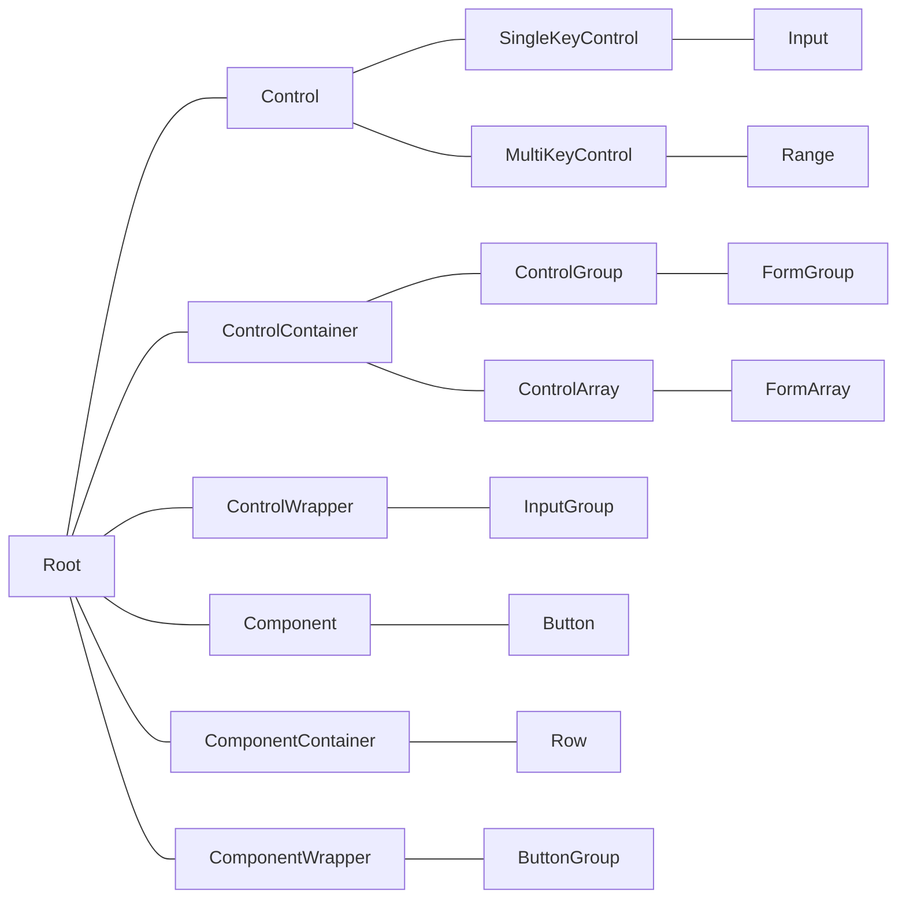

```mermaid
graph LR

Root --- Control
Root --- ControlContainer
Root --- ControlWrapper
Root --- Component
Root --- ComponentContainer
Root --- ComponentWrapper

Control --- SingleKeyControl
Control --- MultiKeyControl

SingleKeyControl --- Input
MultiKeyControl --- Range

ControlContainer --- ControlGroup
ControlContainer --- ControlArray

ControlGroup --- FormGroup
ControlArray --- FormArray

ControlWrapper --- InputGroup

Component --- Button

ComponentContainer --- Row

ComponentWrapper --- ButtonGroup
```

 

#### Wrapper 与 Container 的区别：
Wrapper 只能包含一层子图示，而 Container 可以包含多层子图示
